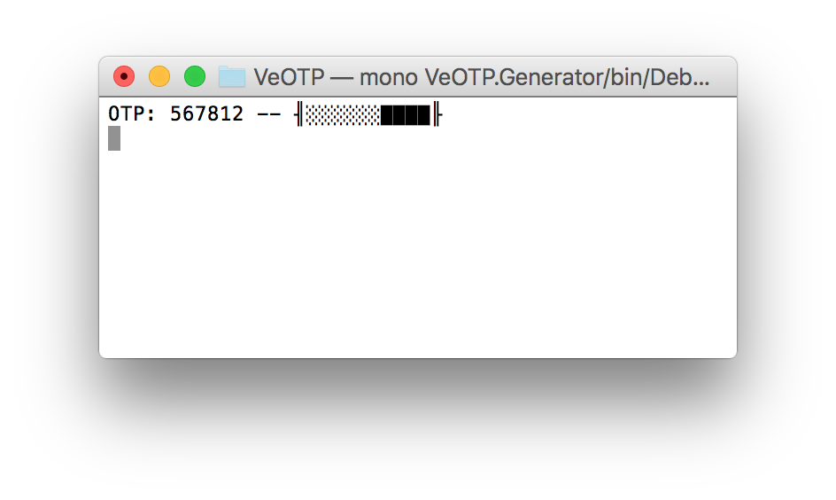
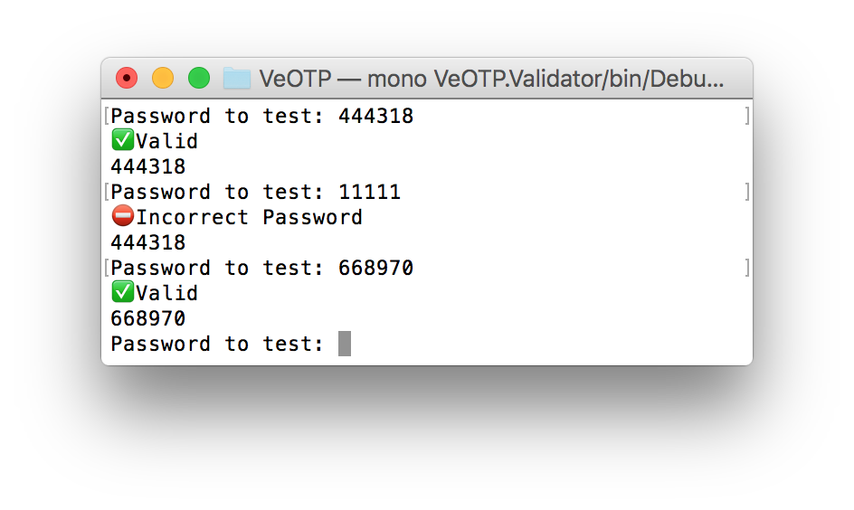

# VeOTP

A simple OTP example. I've created a library named VeOTP.Common that can be used to generate Time-Based One Time Passwords (TOPT).

In the implementation of this I followed guidance in [rfc6238](https://tools.ietf.org/html/rfc6238). 
I have not attempted to provide any of the functionality for clock drift or re-synchronisation.
I've implemented some tests to give coverage and test the assumptions I made in implementation and they do provide coverage on this library. 

To demonstrate usage of the functionality I created two console apps. One to show how use the generation and the other for validation.

